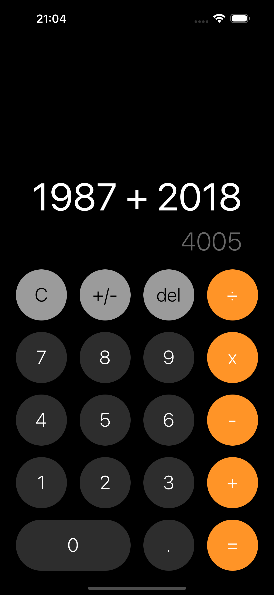

# Calculator App

Este é um projeto de uma aplicação de calculadora desenvolvida em React Native.

## Descrição



A calculadora foi inspirada na calculadora do iOS e é uma aplicação simples que permite ao usuário realizar operações aritméticas básicas como adição, subtração, multiplicação e divisão. A interface do usuário é projetada para ser intuitiva e fácil de usar em dispositivos móveis.

## Funcionalidades

- Adição, subtração, multiplicação e divisão
- Alternar entre números positivos e negativos
- Limpar a tela de cálculo
- Apagar o último dígito inserido
- Exibição de fórmulas e resultados anteriores

## Instalação

1. Clone o repositório:

   ```bash
   git clone https://github.com/carlosxfelipe/rn-calculator.git
   cd calculator
   ```

2. Instale as dependências:

   `npm install`

3. Execute a aplicação no simulador iOS:

   `npm run ios:simulator`
